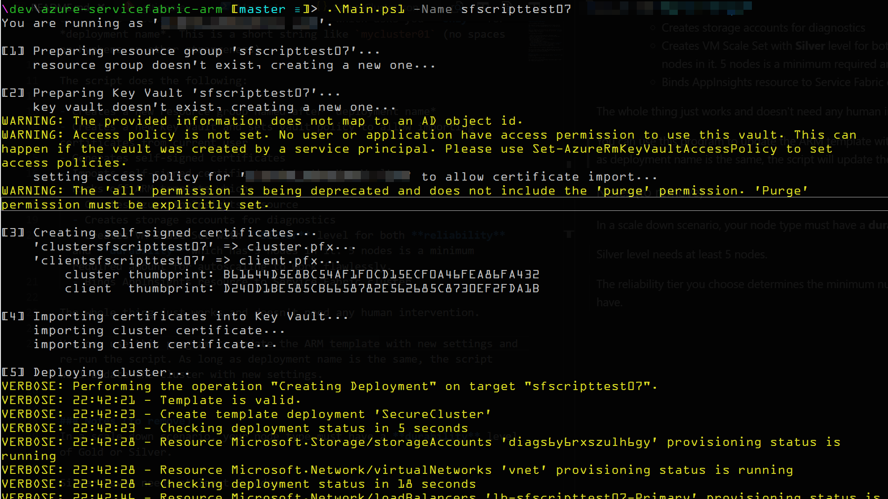
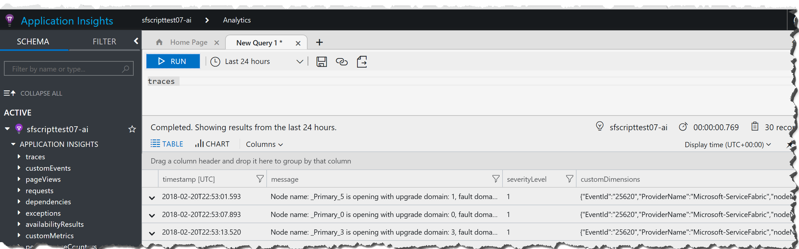
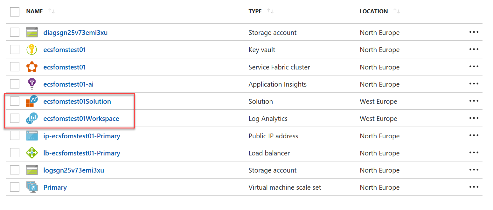

# Azure Service Fabric cluster deployment (for lazy people)

This repository contains fully automated script to create a Service Fabric cluster with least hand movement possible. Just sit back and enjoy.

## How to use

Clone this repository and launch `cluster.ps1` which asks you **only** for *deployment name*. This is a short string like `mycluster01` (no spaces or hyphens or other strangeness).

Apparently before running the script you need to:
- Log in to azure account with `Login-AzureRmAccount`
- Optionally select the subscription you wan to work with (view subscriptions with `Get-AzureRmSubscription` and choose with `Select-AzureRmSubscription`) otherwise the cluster will be created in your default subscription.

The script does the following:

- Creates a new resource group named after *deployment name*
- Creates a new Key Vault and sets vault policy to allow importing certificates from current user
- Generates self-signed certificates
- Imports self-signed certificates into the Key Vault
- Kicks off ARM template which:
  - Creates Azure AppInsights resource
  - Creates storage accounts for diagnostics
  - Creates VM Scale Set with **Silver** level for both **reliability** and **durability** which has 5 nodes in it. 5 nodes is a minimum required amount for autoscaling to work flawlessly.
  - Binds AppInsights resource to Service Fabric cluster
- Enables Reverse Proxy
- Enables DNS Service

The whole thing just works and doesn't need any human intervention.



A proof that AppInsights actually works:



You can use this program to update the ARM template with new settings and re-run the script. As long as deployment name is the same, the script will update the cluster with new settings.

## How do I access Service Fabric explorer from my browser?

> todo: short answer - use cluster cert generated locally
> todo: install client cert in the cluster 'cos i'm lazy.

## Deploying OMS (Log Analytics)

You can deploy **OMS** alongside the cluster, which is an *optional feature*. To deploy it, just pass a switch to `cluster.ps1`:

```powershell
.\cluster.ps1 -Name mycluster -DeployOMS
```

You will see OMS solution and workspace deployed to the resource group and connected to Azure Service Fabric cluster:



## Deploying a mini cluster

This cluster type should only be used for development purposes or really small applications. The cluster is still secure and has full capabilities like above, however it can't be scaled and reliability level is set to *None*. To create this cluster pass `-MiniCluster` switch to the script.

## Active Directory Authentication

> todo

## Known Issues

Please read the [Known Issues](knownissues.md) for possible problems you may encounter while using this script.