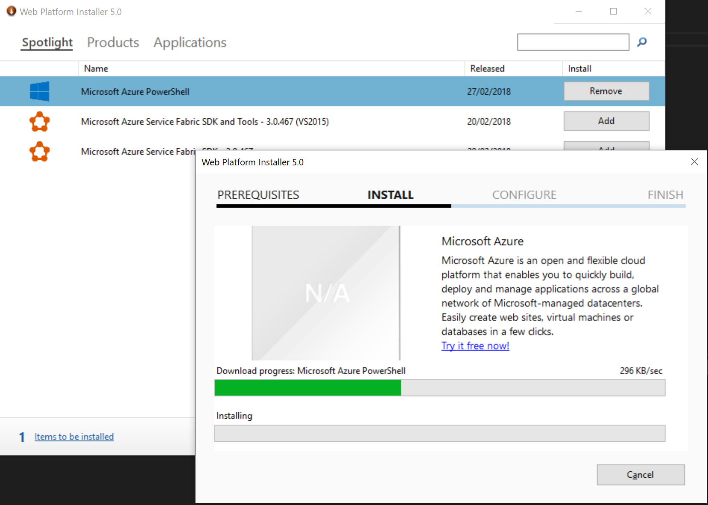

# Known Issues

Sometimes when running a script you may see the following error

```
[4] Importing certificates into Key Vault...
    importing cluster certificate...
Import-AzureKeyVaultCertificate : Method not found: 'System.String
Microsoft.Azure.KeyVault.Models.CertificateAttributes.get_RecoveryLevel()'.
At C:\dev\azure-servicefabric-arm\cluster.ps1:89 char:24
+ $importedClusterCert = Import-AzureKeyVaultCertificate `
+                        ~~~~~~~~~~~~~~~~~~~~~~~~~~~~~~~~~
    + CategoryInfo          : NotSpecified: (:) [Import-AzureKeyVaultCertificate], MissingMethodException
    + FullyQualifiedErrorId : System.MissingMethodException,Microsoft.Azure.Commands.KeyVault.ImportAzureKeyVa
   ultCertificate
```

